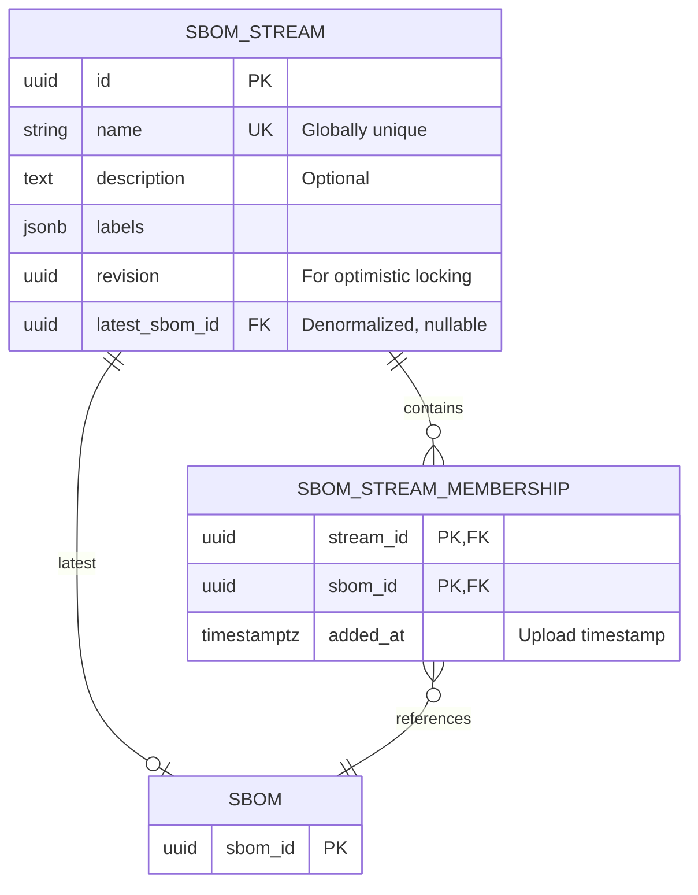

# 00014. SBOM Streams

## Status

PROPOSED

## Context

When a component evolves over time, each new version produces a new SBOM. Over time, this results in many SBOMs for
the same logical component, all existing as independent, unrelated documents in Trustify. There is no concept that ties
them together as "successive SBOMs for the same component."

This creates two problems:

1. **Finding the latest**: When a user wants to know the current state of a component, they must manually determine
   which SBOM is the most recent. There is no grouping or ordering that surfaces "this is the latest SBOM for this
   component."

2. **Information overload**: Active components that receive frequent updates generate a large number of SBOMs. Without
   a way to distinguish the latest from the historical, users are presented with a flat list that is difficult to
   navigate.

At the same time, older SBOMs must be retained because the corresponding component versions may still be deployed.

### Multiple active release lines

Some components maintain multiple active release lines (e.g. 1.2.x and 1.3.x). Both lines continue to receive updates
and both have a "latest" SBOM. A simple group-by-component-name approach would collapse these into a single sequence,
losing the distinction between release lines.

### Relationship to SBOM Groups (ADR 00013)

SBOM Groups (ADR 00013) provide a manual, folder-style organizational tool. Users explicitly create groups and assign
SBOMs to them. Groups are hierarchical, carry no inherent semantic meaning, and support many-to-many assignment.

Streams are fundamentally different: they represent a **temporal sequence** of SBOMs for the same component,
automatically maintained, with an inherent notion of ordering and "latest."

The two concepts are orthogonal but composable:

- A **stream** answers: "What is the latest SBOM for this component?"
- A **group** answers: "Which SBOMs belong to this organizational category?"

A future integration could allow groups to subscribe to streams, automatically including the latest SBOM from
subscribed streams. This ADR does not define that integration, but the data model is designed to support it.

## Details

### Data Model



Each SBOM belongs to **at most one** stream. This is enforced by a unique constraint on
`SBOM_STREAM_MEMBERSHIP.sbom_id`.

The `latest_sbom_id` on `SBOM_STREAM` is a denormalized field for fast lookups. It points to the membership entry
with the most recent `added_at` timestamp. It is updated whenever an SBOM is added to or removed from the stream.

This would be modeled in SQL like:

```sql
CREATE TABLE SBOM_STREAM
(
    ID             UUID NOT NULL PRIMARY KEY,
    NAME           TEXT NOT NULL,
    DESCRIPTION    TEXT,
    LABELS         JSONB NOT NULL DEFAULT '{}',
    REVISION       UUID NOT NULL,
    LATEST_SBOM_ID UUID,

    CONSTRAINT FK_LATEST_SBOM FOREIGN KEY (LATEST_SBOM_ID) REFERENCES SBOM (SBOM_ID) ON DELETE SET NULL,
    CONSTRAINT UNIQUE_STREAM_NAME UNIQUE (NAME)
);

CREATE INDEX IDX_SBOM_STREAM_LABELS ON SBOM_STREAM USING GIN (LABELS);

CREATE TABLE SBOM_STREAM_MEMBERSHIP
(
    STREAM_ID UUID NOT NULL REFERENCES SBOM_STREAM (ID) ON DELETE CASCADE,
    SBOM_ID   UUID NOT NULL REFERENCES SBOM (SBOM_ID) ON DELETE CASCADE,
    ADDED_AT  TIMESTAMPTZ NOT NULL DEFAULT NOW(),

    PRIMARY KEY (STREAM_ID, SBOM_ID),
    CONSTRAINT UNIQUE_SBOM_STREAM UNIQUE (SBOM_ID)
);

CREATE INDEX IDX_SBOM_STREAM_MEMBERSHIP_STREAM ON SBOM_STREAM_MEMBERSHIP (STREAM_ID);
```

### Stream Identity and Automatic Creation

When an SBOM is uploaded, the uploader may specify a `stream` parameter (a stream name). The system then:

1. Looks up the stream by name.
2. If the stream does not exist, creates it automatically with the given name.
3. Adds the SBOM to the stream as a new membership entry.
4. Updates `latest_sbom_id` if this SBOM's `added_at` is more recent than the current latest.

If no `stream` parameter is provided, the SBOM is not assigned to any stream. This preserves backward compatibility
with existing workflows.

Stream names are free-form strings. The following validation rules apply:

* Names must have a length between 1 and 255 characters
* Names must not start or end with whitespace characters

### Ordering

Within a stream, SBOMs are ordered by their `added_at` timestamp (the time they were added to the stream). The SBOM
with the most recent `added_at` is the "latest."

## Decision

### Permissions

The following new permissions will be added:

* `ReadSbomStream`: Allow reading SBOM streams and stream information
* `CreateSbomStream`: Allow creating new SBOM streams (also required for automatic creation during upload)
* `UpdateSbomStream`: Allow updating existing SBOM streams
* `DeleteSbomStream`: Allow deleting SBOM streams

### API Data Model

```rust
/// The base stream information
#[derive(Serialize, Deserialize)]
struct SbomStream {
    id: Uuid,
    name: String,
    #[serde(default, skip_serializing_if = "Option::is_none")]
    description: Option<String>,
    #[serde(default, skip_serializing_if = "BTreeMap::is_empty")]
    labels: BTreeMap<String, String>,
    #[serde(default, skip_serializing_if = "Option::is_none")]
    latest_sbom_id: Option<Uuid>,
}
```

```rust
/// Stream information with additional details
#[derive(Serialize, Deserialize)]
struct SbomStreamDetails {
    #[serde(flatten)]
    stream: SbomStream,
    /// The total number of SBOMs in this stream
    #[serde(default, skip_serializing_if = "Option::is_none")]
    number_of_sboms: Option<u64>,
}
```

```rust
/// Stream information that can be mutated
#[derive(Serialize, Deserialize)]
struct SbomStreamRequest {
    name: String,
    #[serde(default, skip_serializing_if = "Option::is_none")]
    description: Option<String>,
    #[serde(default, skip_serializing_if = "BTreeMap::is_empty")]
    labels: BTreeMap<String, String>,
}
```

### GET `/api/v2/sbom/stream`

List all streams.

#### Request

| part  | name     | type       | description                                             |
|-------|----------|------------|---------------------------------------------------------|
| query | `q`      | "q" string | "q style" query string                                  |
| query | `totals` | boolean    | Provide count of SBOMs in each stream                   |
| query | `limit`  | u64        | Maximum number of items to return                       |
| query | `offset` | u64        | Initial items to skip before actually returning results |

The following `q` parameters are supported:

* `name`: Filters streams by their name.

#### Response

* 200 - if the user is allowed to read streams

  ```rust
  #[derive(Serialize, Deserialize)]
  struct PaginatedSbomStream {
      total: u64,
      items: Vec<SbomStreamDetails>,
  }
  ```

* 401 - if the user was not authenticated
* 403 - if the user was authenticated but not authorized

### GET `/api/v2/sbom/stream/{id}`

Get stream details.

#### Response

* 200 - if the stream was found

  | part    | name   | type         | description                        |
  |---------|--------|--------------|------------------------------------|
  | body    | -      | `SbomStream` | The stream information             |
  | headers | `ETag` | string       | Value which indicates the revision |

* 401 - if the user was not authenticated
* 404 - if the stream was not found or the user doesn't have permission to read it

### GET `/api/v2/sbom/stream/{id}/history`

List all SBOMs in a stream, ordered by `added_at` descending (most recent first).

#### Request

| part  | name     | type | description                                             |
|-------|----------|------|---------------------------------------------------------|
| query | `limit`  | u64  | Maximum number of items to return                       |
| query | `offset` | u64  | Initial items to skip before actually returning results |

#### Response

* 200 - if the stream was found

  A paginated list of SBOMs with their `added_at` timestamp.

* 401 - if the user was not authenticated
* 404 - if the stream was not found

### POST `/api/v2/sbom/stream`

Manually create a new stream. This is optional since streams are created automatically during SBOM upload,
but allows pre-creating streams with descriptions and labels.

#### Request

| part | name | type                | description |
|------|------|---------------------|-------------|
| body | -    | `SbomStreamRequest` |             |

#### Response

* 201 - the stream was created
* 400 - if the request could not be understood
* 400 - if the name of the stream is not allowed
* 401 - if the user was not authenticated
* 403 - if the user was authenticated but not authorized
* 409 - if a stream with that name already exists

### PUT `/api/v2/sbom/stream/{id}`

Update an existing stream's metadata (name, description, labels).

#### Request

| part   | name      | type                | description                    |
|--------|-----------|---------------------|--------------------------------|
| body   | -         | `SbomStreamRequest` | The new content                |
| header | `IfMatch` | `Option<String>`    | ETag value, revision to update |

#### Response

* 204 - the stream was updated
* 400 - if the request could not be understood
* 401 - if the user was not authenticated
* 403 - if the user was authenticated but not authorized
* 409 - if the stream name conflicts with an existing stream
* 412 - if the `IfMatch` header was present, but its value didn't match the stored revision

### DELETE `/api/v2/sbom/stream/{id}`

Delete a stream. All membership entries are removed. The SBOMs themselves are not deleted.

#### Request

| part   | name      | type             | description                    |
|--------|-----------|------------------|--------------------------------|
| path   | `id`      | `String`         | ID of the stream to delete     |
| header | `IfMatch` | `Option<String>` | ETag value, revision to delete |

#### Response

* 204 - if the stream was successfully deleted
* 204 - if the stream was already deleted
* 400 - if the request could not be understood
* 401 - if the user was not authenticated
* 403 - if the user was authenticated but not authorized
* 412 - if the `IfMatch` header was present, but its value didn't match the stored revision

### POST `/api/v2/sbom`

Extend the existing SBOM upload endpoint with an optional `stream` parameter.

| part  | name     | type   | description                                            |
|-------|----------|--------|--------------------------------------------------------|
| query | `stream` | String | Stream name. Created automatically if it doesn't exist |

When provided, the uploaded SBOM is added to the specified stream after ingestion. If the stream does not exist,
it is created with the given name and no description or labels.

### GET `/api/v2/sbom`

Extend the existing SBOM listing endpoint with stream-related filters.

| part  | name            | type    | description                                              |
|-------|-----------------|---------|----------------------------------------------------------|
| query | `stream`        | String  | Filter to SBOMs belonging to the stream with this ID     |
| query | `stream_latest` | boolean | If true, only return SBOMs that are latest in any stream |

The `stream_latest` filter provides a de-duplicated view showing only the most current SBOM for each component,
addressing the information overload problem.

## Consequences

* We provide access to the described APIs
* There should be no performance degradation of existing APIs
* SBOMs uploaded without a `stream` parameter behave exactly as they do today

## Future Tasks

* Rule-based stream assignment: automatically derive stream names from SBOM metadata (e.g. component name,
  image repository, major.minor version) without requiring the uploader to specify a stream explicitly
* Group-stream subscriptions: allow SBOM groups to subscribe to streams, automatically including the latest
  SBOM from subscribed streams
* UI: dedicated stream views, stream history browsing, and stream-aware dashboards
