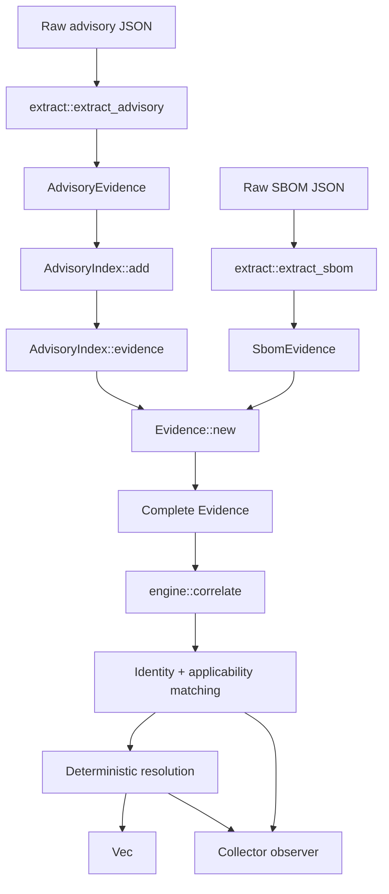

# 00022. Correlation engine — getting vulnerability matching right

Date: 2026-09-11

## Status

ACCEPTED

## Definition of Vulnerability Correlation

Regardless of implementation we need a stable, constrained definition of 
vulnerability correlation.

For this document, vulnerability correlation determines whether an advisory's 
vulnerability assertion applies to a specific component and version.

The result is an evidence-backed verdict (eg. not just a name-only lookup).

The fundamental unit is:

```text
(component, vulnerability) -> verdict + provenance(evidence)
```

Correlating an SBOM means constructing correlation queries from all relevant
evidence declared by the SBOM (where matching components in sbom are applicable). 

The atomic result is still a verdict for one component and one vulnerability but the query may use several scopes of 
identity and context:

- **Component identity**: correlate a package or artifact by PURL, CPE, hash,
  digest, or another supported component identifier.
- **Component plus context**: correlate a package together with the product,
  operating system, image, platform, or other describing CPE under which it is
  installed.
- **Product or CPE-only identity**: correlate a product node when the SBOM
  declares a product CPE but no package identity. This is a product-level
  assessment, not proof that every package in the product is installed.
- **Grouped components**: use package relationships, containment, dependency
  edges, or image/application membership to establish context or scope. A
  grouping must not make an advisory for one package apply to an unrelated
  package merely because they share a name or SBOM.
- **Whole-SBOM context**: use the SBOM as the container for the queries and to
  aggregate component verdicts. The SBOM itself is not a substitute for a
  component identity unless the advisory assertion is explicitly product-level.

The same model applies when a caller starts with a single PURL, CPE, digest,
component group, or complete SBOM. Each query is normalized into component
identity, context, applicability and evidence before producing a verdict.

Determining correlation has three conceptual stages:

```text
data -> evidence -> verdict
```

### Data
Raw advisory and SBOM documents in their original formats:
- CSAF/VEX
- CVE 5.x/OSV
- CycloneDX/SPDX

### Evidence
While underlying data artifacts provide original 'evidence' there should be a normalised
set of format-independent facts extracted from such raw documents:
- Vulnerability assertions
- Component identities
- Grouping/Product ( and arch, operating-system context, etc)
- Version constraints
- Assertion source and identifier

An assertion says that a vulnerability has a status for a component identity,
optionally subject to a version constraint.

### Verdict

A resolved determination for one component and one vulnerability. Every
verdict should retain the assertions and matching decisions/provenance/evidence 
that produced it as well as confidence in determination.

### Component Identity

Component identity may include:

- PURL type or ecosystem
- PURL namespace and name
- PURL qualifiers
- Component version
- CPE
- Hash or digest
- Describing product or operating-system context
- Package relationship to that context

Identity matching must use the strongest available evidence.

### Matching Rules

Correlation requires two decisions.

#### Identity Match

The advisory assertion must identify the same component (or grouping/product):

- PURL type or scheme must match.
- PURL namespace and name must match.
- Relevant qualifiers must match.
- CPE vendor and product identity must match.
- Hashes must match exactly when used.
- Grouping/Product-scoped assertions require matching group/product context.

For example, a package installed under a product CPE, the required identity would need:

```text
package identity matches
AND
describing product context matches
```

#### Applicability Match

After identity matches, the component must satisfy an advisory's
applicability rules, for example:

- Use version scheme declared by the advisory.
- Compare component versions with component version ranges.
- A bare `known_affected` assertion applies to all versions within its identity scope.
- An exact fixed assertion applies only according to its declared scope and version semantics.
- Do not infer an affected range from an exact fixed version unless that is an explicit policy.

### Status Resolution

All applicable assertions for the same component and vulnerability are grouped
before producing a verdict with resolution rules such as follows:

- `affected` means an applicable assertion says the component is affected.
- `fixed` resolves an applicable affected assertion for the same component and version.
- `not_affected` resolves an applicable affected assertion for the same component and version.
- More specific package evidence takes precedence over broader product evidence.
- For CPE-only product assertions, an affected assertion may conservatively win when the product has no component-level identity.
- Conflicts must resolve deterministically and retain all contributing evidence.

### Verdict Semantics

| Verdict | Meaning |
|---|---|
| `affected` | An applicable affected assertion remains after resolution. |
| `fixed` | An applicable fixed assertion resolves the component. |
| `not_affected` | An applicable non-affected assertion resolves the component. |
| `none` | No applicable assertion was found. This is unknown, not proof of safety. |
| `under_investigation` | An assertion applies, but it does not establish a definitive result. |

The following distinction is mandatory:

```text
no applicable assertion != not affected
```

An absent match must not be converted into a negative security claim.

### Evidence And Traceability

Each verdict should expose:

- Component identity used for the query
- Vulnerability identifier
- Identity matcher that matched
- Version constraint and comparison result
- Assertion source document
- Assertion status
- Product or CPE context
- Resolution rule applied

This allows a consumer to answer both:

```text
What is the result?
```

and:

```text
Why did the engine produce it?
```

A verdict must include evidence and providence of its decision along with a measure of confidence in the verdict reflecting quality of data, strength
of evidence as well as contradictory evidence.

## Context

Trustify correlates SBOM components with advisory data to determine vulnerability status.
The existing infrastructure — `purl_status`, version-comparison SQL functions, and
ingestion-time resolution — provides a working baseline, but has gaps:

* **Format coverage.** CSAF-driven PURL status works well, but CVE 5.x version semantics
  (lessThan, defaultStatus), OSV range events, and CPE-based product-level matching are
  incomplete or missing.

* **Version constraints.** Real-world advisories express version constraints in many ways:
  VERS ranges, CSAF `first_fixed`, CVE version ranges with different comparison schemes,
  OSV event pairs. Not all are evaluated correctly.

* **Verdict resolution.** When multiple assertions from different sources conflict for the
  same component and vulnerability, the rules for which status wins are not well-defined.
  PURL-level and CPE-level assertions carry different confidence and need different
  resolution logic.

* **Testability.** There is no way to define a self-contained scenario — advisories, SBOMs,
  and expected verdicts — and verify the engine produces the right answer. Without this,
  correctness regressions go undetected.

### Goal

Build a second correlation engine alongside the existing one. Reuse existing data, logic,
and database structures where they work; extend them where they fall short. Start by getting
correlation **right** — validate matching semantics against concrete scenarios before
integrating with the server.


## Decision

### The correlation pipeline

The correlation flow is structured as a pipeline with clear conceptual stages:

```
Data → Evidence → Verdict
```

1. **Data** — raw advisory and SBOM documents in their original formats (CSAF, CVE 5.x,
   OSV, SPDX, CycloneDX). These are the inputs, ingested as-is without loss.

2. **Evidence** — normalized, format-independent facts extracted from the data:
   - *Status assertions* — an advisory's claim that a component (identified by PURL, CPE,
     or product name) has a particular status (affected, fixed, not_affected) for a given
     vulnerability, optionally scoped by a version constraint.
   - *Component identities* — the PURLs, CPEs, and versions that an SBOM declares for each
     of its components.

   This is the "what do we know" layer. Format-specific extraction (CSAF product tree
   walking, CVE defaultStatus, OSV event pairs, first_fixed promotion) happens here and
   only here — downstream stages work entirely on evidence, not on raw documents.

3. **Verdict** — the resolved determination per component, per vulnerability. The engine
   matches component identities against assertions (identity match, then version match),
   groups matches by vulnerability, and resolves conflicts:
   - PURL-level: fixed/not_affected overrides affected (more specific wins).
   - CPE-only: affected wins (conservative product-level assessment).
   - Mixed: PURL-level takes precedence.

   Each verdict carries references back to the evidence that produced it, making the
   reasoning traceable.

This pipeline is the conceptual model regardless of where each stage runs — with an in-memory index for
scenario testing, in the database for production queries, or in WASM for browser tooling.
The stages and their contracts stay the same; the execution substrate can change.

### Development approach: scenarios first

Introduce `modules/correlation/` as a new workspace member. The initial implementation is a
pure-Rust library with no database dependencies, so the pipeline can be developed and tested
in isolation using file-based scenarios. This is a development strategy — server integration
follows once the semantics are validated.

The minimal dependency profile also enables WASM compilation for browser-based correlation
tooling.

### Version comparison

The engine needs version comparison covering semver, RPM, Maven, Python, generic, and git
schemes, plus VERS range expressions. The initial implementation provides this as a
pure-Rust library consistent with the existing PostgreSQL version functions. Whether the
production path evaluates versions in Rust, in SQL, or both is an open question — the
matching semantics are what matter, not where the comparison runs.

### Scenario-based testing

Test scenarios in `etc/test-data/scenarios/` each contain advisory files, SBOMs (in both
SPDX and CycloneDX), and an `expected.json` with ground-truth verdicts. The test harness
feeds the documents through the full pipeline (data → evidence → verdict) and asserts the
results match.

This is the primary tool for getting correlation right. Each scenario captures a specific
matching challenge as an executable specification. New scenarios are added as edge cases
surface, building a growing regression suite:

| Scenario | Description | Status | Blocker |
|----------|-------------|--------|---------|
| S1a | Cross-stream VERS ranges (bind-libs across RHEL streams) | pass | |
| S3a | Product scoping — VERS must not match wrong product | pass | |
| S5a | VERS-based affected range (openssl) | pass | |
| S6 | OSV with CVE aliases (urllib3) | pass | |
| S7 | CPE-only product node correlation | pass | |
| S8a | RPM epoch handling (openjdk) | pass | |
| S12a | VERS-based affected range (thunderbird) | pass | |
| S13 | Aliasless OSV — native GHSA ID, no CVE alias | pass | |
| S1 | Cross-stream matching without VERS | fail | TC-2621: version comparison alone cannot distinguish streams |
| S2 | Wrong version scheme (golang OCI) | fail | TC-2622 |
| S3 | Wrong product matching (hummingbird/curl) | fail | TC-2623 |
| S4 | Wrong product matching (satellite/chardet) | fail | TC-2624 |
| S5 | Positive baseline openssl (no VERS) | fail | TC-5643: upstream CSAF lacks VERS ranges |
| S8 | Epoch mismatch openjdk (no VERS) | fail | TC-5643: upstream CSAF lacks VERS ranges |
| S9 | Substream filtering (openssl el8) | fail | TC-2625 |
| S10 | Combined describing CPE | fail | TC-5643: versionless PURLs and missing VERS ranges |
| S11 | Bare-affected substream (firefox) | fail | TC-2626 |
| S12 | Not-affected ignored (thunderbird, no VERS) | fail | TC-5643: versionless PURLs for product-level not_affected |
| S14 | Product status version filter (netty) | fail | TC-2627 |
| S16 | Cross-scheme PURL query (golang) | fail | TC-2628 |
| S17 | Cross-product OCP kernel/go | fail | TC-2629 |

### Flow



### Example

Entry point
```rust
let advisory = extract::extract_advisory("advisory.json", &advisory_json);
let sbom = extract::extract_sbom("sbom.json", &sbom_json)?;

let mut advisories = AdvisoryIndex::new();
advisories.add(advisory);

let evidence = Evidence::new(advisories.evidence(), sbom);
let mut collector = VecCollector::default();

let verdicts = correlate(&evidence, &mut collector);
```

## Consequences

### Positive

* **Correctness-first.** Scenario tests validate the full pipeline before server
  integration, catching issues early.
* **Full format coverage.** One pipeline handles CSAF, CVE 5.x, and OSV against both SPDX
  and CycloneDX, closing gaps in the existing paths.
* **Clear conceptual model.** The data → evidence → verdict pipeline separates concerns:
  format-specific extraction is isolated in the evidence stage, matching and resolution
  operate on uniform types, and verdicts are traceable back to the evidence that produced
  them.
* **Substrate-independent.** The pipeline's stages and contracts are defined independently
  of where they execute — enabling in-memory testing, database-backed production, and
  browser-side WASM from the same design.
* **Incremental integration.** The engine can be wired into the server progressively,
  reusing existing DB structures and extending them where needed.

### Negative

* **Two correlation paths during transition.** Until integration is complete, the existing
  and new engines coexist. Divergent results are possible and need to be managed.
* **Version comparison in two places.** During development the same logic exists in both
  Rust and SQL. Where it ultimately lives is an open decision; the scenario tests ensure
  the semantics stay consistent regardless.

### Future work

* **Server integration** — wire the pipeline into Trustify's backend, reusing existing
  database structures and adding new ones where the current schema does not capture what
  the engine needs. Expose via HTTP endpoints and/or background jobs.
* **Convergence** — as the engine proves correct, migrate existing ingestion-time resolution
  to use the same pipeline, establishing a single source of truth.
* **Scaling** — the initial in-memory advisory index uses linear scanning. The production path will
  need database-backed querying or indexing for the full dataset.
* **Confidence scoring** — augment verdicts with match-quality signals (exact PURL vs CPE
  prefix, version constraint precision, assertion recency).

## References

* VERS specification: <https://github.com/package-url/vers>
* CSAF standard: <https://docs.oasis-open.org/csaf/csaf/v2.0/csaf-v2.0.html>
* CVE 5.x schema: <https://cveproject.github.io/cve-schema/schema/docs/>
* OSV schema: <https://ossf.github.io/osv-schema/>
